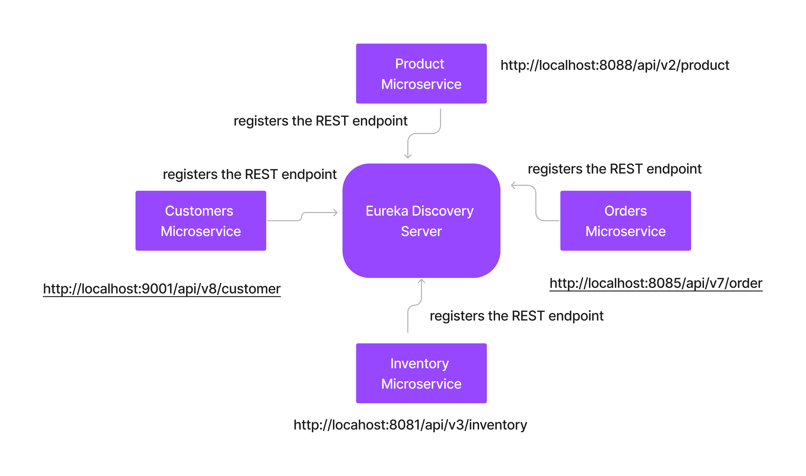

# Day 4

## Spring Boot vs Spring Cloud

### Spring Boot
- a Java Framework that is used to develop Java based RESTful services and Microservices
- it is developed on top of Spring Framework
- the Spring Framework required loads of manual configuration which was then simplified by Spring boot
- Spring boot framework simplifies configurations based on easy to use annotations

### Spring Cloud
- Spring Boot Framework supports both Spring Boot and Spring Cloud
- Spring Cloud offers
   - Load Balancing
   - Service Discovery
   - Security
   - Event based communication
   - Routing 

## Setting up RabbitMQ as a Docker Container
```
docker run -it --rm --name rabbitmq -p 5672:5672 -p 15672:15672 rabbitmq:3.10-management
```

In the above the port 5672 is used by microservices while exchanging message on the RabbitMQ Server. The 15672 port is used for Administration purpose,where the Administrator can view and manage the queues and the overall RabbitMQ via a Web based Dashboard @ Port 15672.  

The default credentials to login to RabbitMQ is given below
<pre>
hostname - can be either your localhost or the rabbitmq container ip
username - guest
password - guest
</pre>

## Starting the Producer Microservice that sends message to the RabbitMQ queue
<pre>
Will add the lab instructions - TODO
We have already completed but instructions need to be added.
</pre>

## Lab - Understanding Eureka Service Discovery



### Eureka Service Discovery
- is a Client-side Service discovery
- every microservice must register themselves with the Eureka Server url (fixed url & port)
- If a Microservice A needs to request some data from Microservice B, then Microservice A need to have some piece of logic to query the Eureka Server to get the Microservice B's url/endpoint.
- Every microservice will keep updating the Eureka Server frequently

### Starting the Netflix Eureka Service Discovery Server
```
cd ~/java-microservices-oct-2022
git pull

cd Day4/service-discovery-with-netflix-eureka/eureka-server
mvn clean package spring-boot:run
```

Accessing the Eureka Server Dashboard from Chrome Web browser
```
http://localhost:8761
```

### Starting the Product Microservice
```
cd ~/java-microservices-oct-2022
git pull

cd Day4/service-discovery-with-netflix-eureka/product
mvn clean package spring-boot:run
```
Observe that the product microservice registering itself with Eureka Server from the terminal.
You may also now check the Eureka Server Dashboard to see the Product microservice registered entry in Web browser.

You can access the product microservice at the below URL
<pre>
http://localhost:8080
</pre>

### Starting the eureka discovery client application
```
cd ~/java-microservices-oct-2022
git pull

cd Day4/service-discovery-with-netflix-eureka/eureka-discovery-client
mvn clean package spring-boot:run
```

Observe that the eureka-discovery-client application registering itself with Eureka Server from the terminal.
You may also now check the Eureka Server Dashboard to see the Eureka Client registered entry in Web browser.

The Eureka Discovery Client application, queries the Eureka services providing the product microservice name to get the product microserivce endpoint.

Once it receives the product microservice endpoint, it then invokes the product microservice endpoint to get the list of the products.

You can try accessing the REST endpoint of this application
<pre>
http://localhost:9000/products
</pre>

When this application is terminated, observe it unregisters itself from the Eureka Server. This is a default behaviour of every Eureka Discovery Client.

## Microservices using message/event based data exchange - helps in decoupling microservice communication
```
cd ~/java-microservices-oct-2022
git pull
cd Day4/rabbitmq-amqp/AMQP
mvn clean package spring-boot:run
```

You may now launch chrome browser and send message using below URL
<pre>
http://localhost:8080/send/AMQP - Hello World!
</pre>
